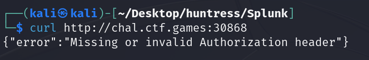
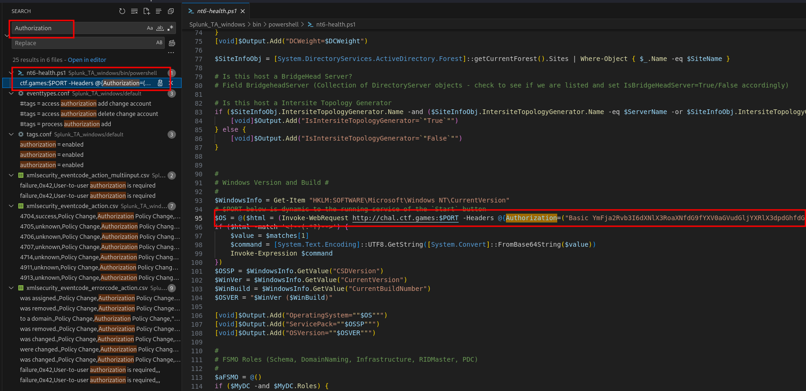
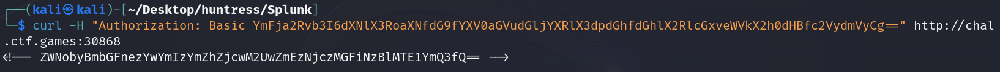
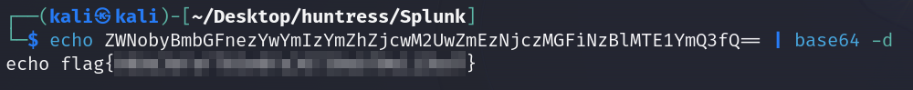

# Solution
- Hit the Start button.
- Download the Splunk_TA_Windows.zip file.
- Unzip the file.
```bash
unzip Splunk_TA_windows.zip 
```
- Notice an header is missing performing a GET request to the URL provided by the challenge.



- Let's search for the "Authorization" header in the Splunk_TA_Windows folder. The header can be found from the very first result.



- Perform a GET request with the Authorization header to get a Base64 response data.



- Base64 decode the data to get the flag.
```bash
echo ZWNobyBmbGFnezYwYmIzYmZhZjcwM2UwZmEzNjczMGFiNzBlMTE1YmQ3fQ== | base64 -d
```


