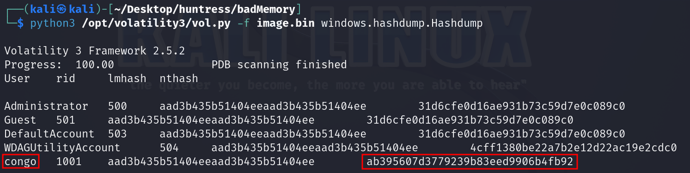
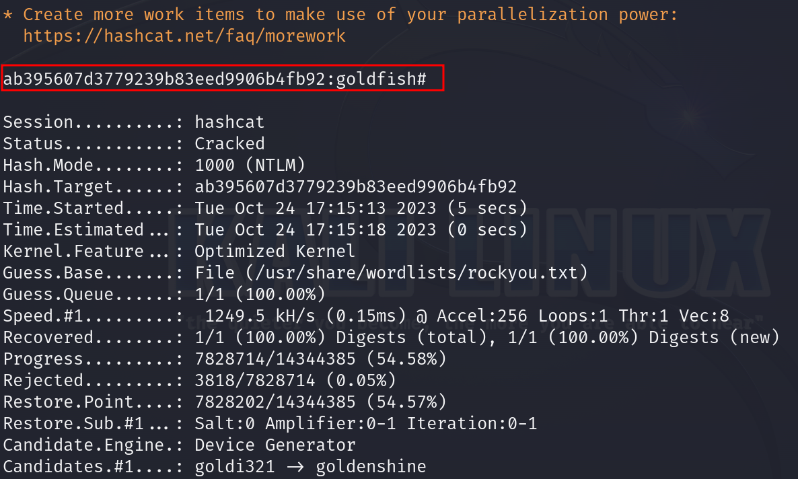

# Solution
- Download the image.zip file. Remeber the flag needs to be formatted properly for this challenge.
- Unzip the file and get the memory dump.
```bash
unzip image.zip
```
- Use volatility3 to extract hashes.
```bash
python3 /opt/volatility3/vol.py -f image.bin windows.hashdump.Hashdump
```



- Save the "congo" nthash password to a file call "hash.txt".
- Crack hash with hashcat:
```bash
hashcat hash.txt -m 1000 --wordlist /usr/share/wordlists/rockyou.txt -O
```



- Generate the md5 of the password:
```bash
echo -n goldfish# | md5sum 
```
- Then, wrap the md5 hash in the flag format such as flag{md5hash}.
