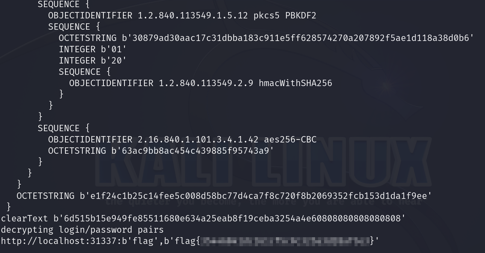

# Solution
- Download the dumpster_fire.tar.xz file.
- Extract the content with:
```bash
tar -xvf dumpster_fire.tar.xz
```
- There is a .mozilla folder browsing the folder home/challenge which can have sensitive data stored related to firefox profiles. A key4.db file is discovered further under home/challenge/.mozilla/firefox/bc1m1zlr.default-release
- firepwd (https://github.com/lclevy/firepwd) has been used to extract data fromo the firefox profile.
- The flag is retrieved running firepwd pointing to the profile directory.
```bash
python firepwd.py -d /home/challenge/.mozilla/firefox/bc1m1zlr.default-release
```


