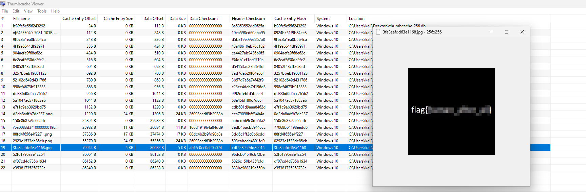

# Solution
- Download the thumbcache_256.db file on a Windows machine. Remember the flag is not in the standard format.
- Google for "thumb cache viewer" and install the thumb cache viewer tool https://thumbcacheviewer.github.io/.
- Open the file with the thumbcacheviewer program.
- Some files have 0 bytes, but others contains something. One of them contains the flag.

