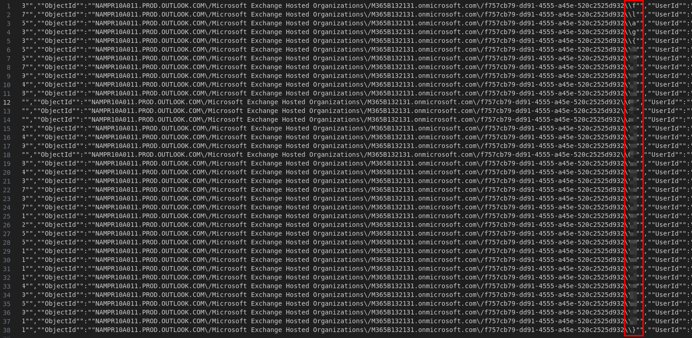
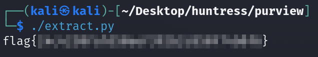

# Solution
- Download the purview.csv file.
- Notice the "ObjectId" and how many lines are stored in the "filtered" file running the following command:
```bash
cat purview.csv | grep "New-InboxRule" |  grep "ObjectId" > filtered 
```


- The flag can be extracted with a Python script.
```python
#!/usr/bin/env python3


def main():
    with open("filtered", "r") as f:
        flag = ""
        for line in f:
            splitted = line.strip().split("f757cb79-dd91-4555-a45e-520c2525d932\\\\")
            flag = flag + splitted[-1][0]
        print(flag)

if __name__ == '__main__':
    main()
```


