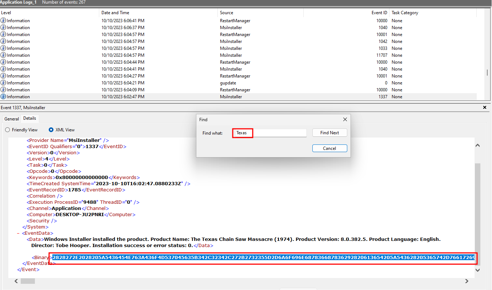
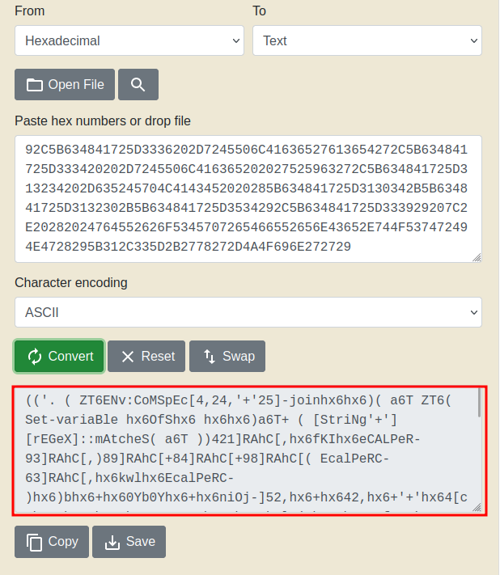
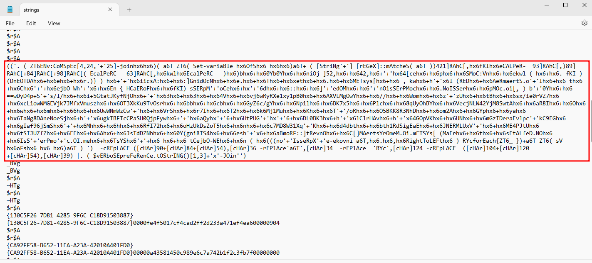
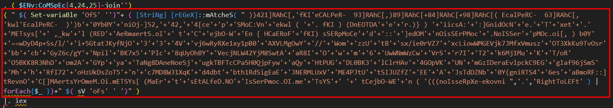
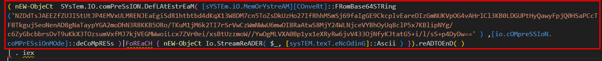
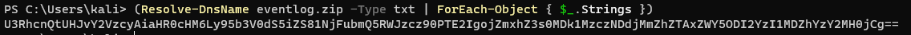
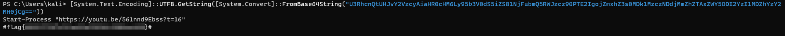

# Solution
- Download the ChainsawMassacre.zip file on a Windows machine.
- Unzip the file and notice the EVTX file. Open the file with the Windows Application logs and search for the keyword "Texas".



- Copy the binary content and convert to a string to get an obfuscated PowerShell script. Save it as run.ps1.



- The Linux command line "strings" can be used as well to extract the obfuscated PowerShell script.
```bash
strings "Application Logs"
```


- Let's deobfuscate the PowerShell script. There is a pipe in the first stage, so run just the first part in a PowerShell and save the output in run1.ps1.


- The run1.ps1 looks split in three chunks as well. So, run the second chunk in a PowerShell and save the output in run2.ps1.



- The run2.ps1 starts showing something like Invoke-Expression command. Run the content of the Invoke-Expression in a PowerShell and save the output in run3.ps1.


- The run3.ps1 script is again split in two chunks. Run the first chunk in a PowerShell script and save the output in run4.ps1



- Finally, there is some readable code, but not the flag yet. At line 4, the script is resolving a domain name. Run that command in a PowerShell and save the output.




- The command produces a Base64 encoded data which is needed to be decode to get the flag.
```PowerShell
[System.Text.Encoding]::UTF8.GetString([System.Convert]::FromBase64String("U3RhcnQtUHJvY2VzcyAiaHR0cHM6Ly95b3V0dS5iZS81NjFubmQ5RWJzcz90PTE2IgojZmxhZ3s0MDk1MzczNDdjMmZhZTAxZWY5ODI2YzI1MDZhYzY2MH0jCg=="))
```


