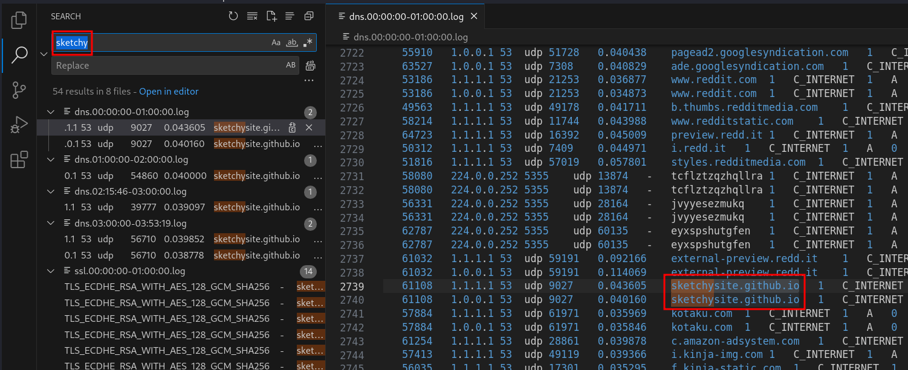
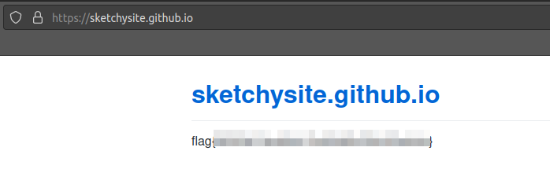

# Solution
- Download the traffic.7z file.
- Extract the content with 7zip:
```bash
7z e traffic.7z
```
- Open the folder with Visual Studio Code and perform a global search for the keyword "sketchy". An interesting website called sketchysite.github.io has been found.



- Browse the website sketchysite.github.io and get the flag.


