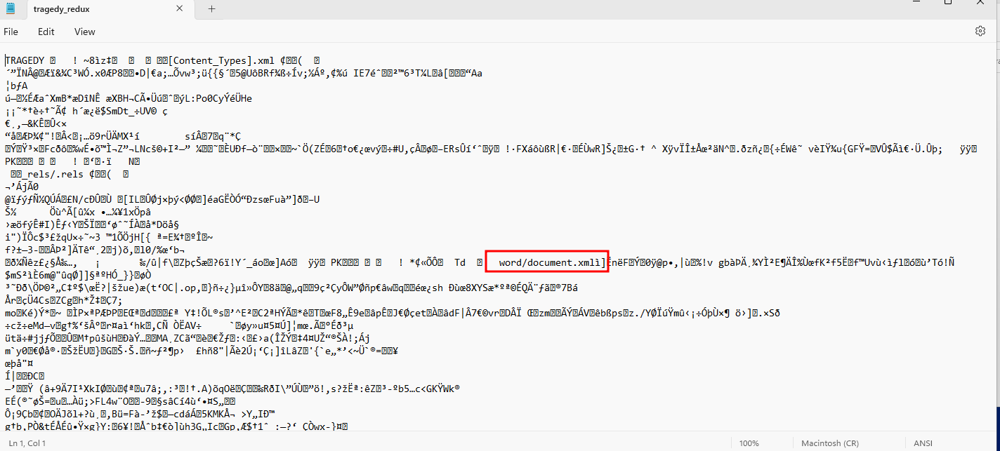

# Solution
- Download the tragedy_redux.7z file on a Windows machine.
- Extract the content with 7zip and a file called "tragedy_redux" is extracted. The file looks like a Word document from a quick glance in Notepad.



- Save the file with the extension .docm, open it in Word and extract the Macros.
- The Visual Basic script has many functions.


- The Visual Basic script can be run by cscript.exe and output can be printed by the function Wscript.Echo. If we print out the variable "Water", a powershell command appears.


- The flag can be obtained by Base64 decoding the output of the previous script:
```bash
echo JGZsYWc9ImZsYWd7NjNkY2M4MmMzMDE5Nzc2OGY0ZDQ1OGRhMTJmNjE4YmN9Ig== | base64 -d
```


