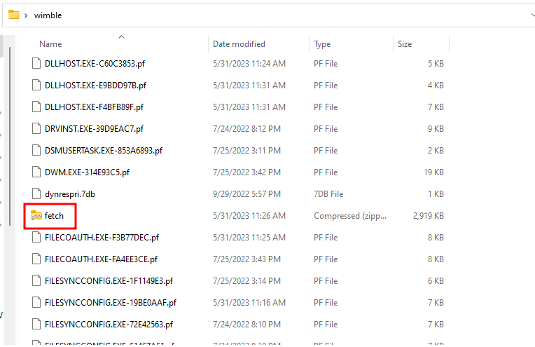

# Solution
- Download the wimble.7z file on a Windows machine.
- Extract the content with 7zip. A file called "fetch" is extracted and it is a WIM file after some researching.
- Extract the "fetch" content file with 7zip again and many Windows prefetch (.pf) files are extracted.



- Among those .pf files, there is another zipped folder called "fetch". Extract the "fetch" folder content with 7zip again.
- After that, the tool https://github.com/EricZimmerman/PECmd can be used to analyze all the .pf file. So, the flag shows up running the following command and pointing to the latest "fetch" folder:
```powershell
.\PECmd.exe -d "C:\Users\kali\Desktop\wimble\fetch" | findstr FLAG

```


