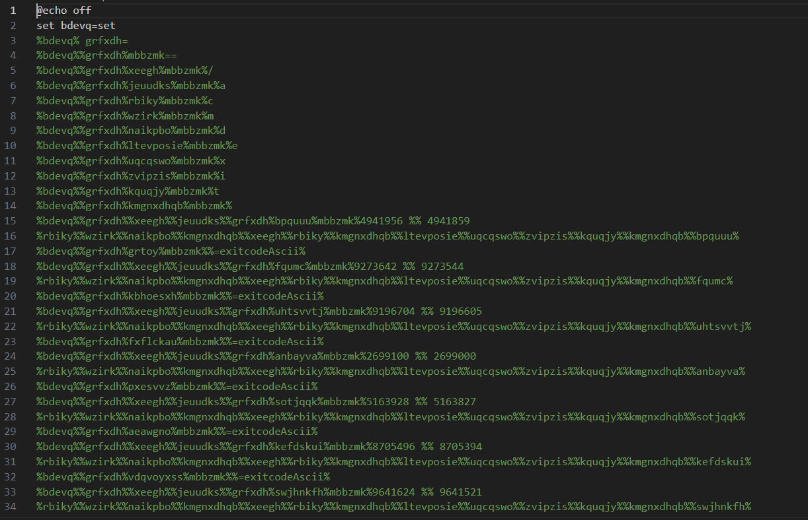
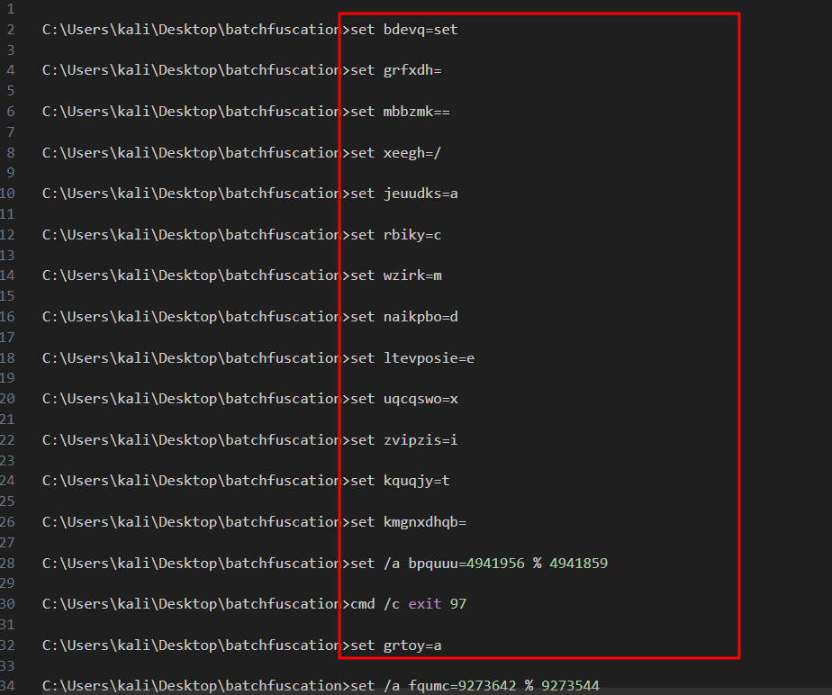
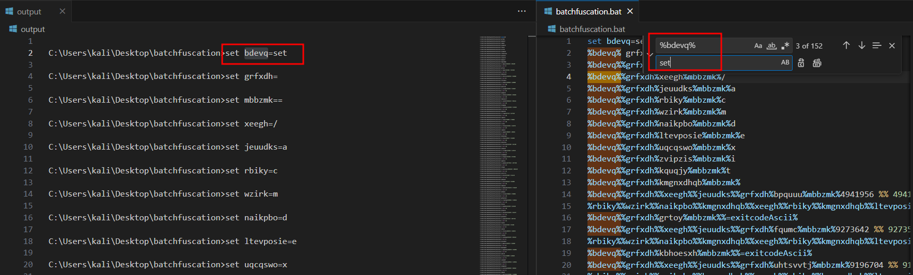
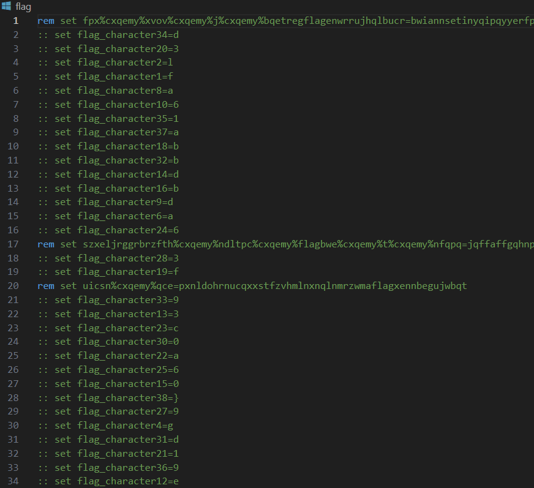

# Solution
- Download the batchfuscation file on a Windows machine.
- Open and notice batch script obfuscated. Rename the file as "batchfuscation.bat".



- Remove the "echo @off" command at the beginning and run the script in a cmd terminal. Save the output in a file a called "output".
```batch
batchfuscation.bat > output
```
- From the output, the character mapping can be retrieved. Search and replace for each of character with Visual Studio Code to deobfuscate the script.





- After the manual work, run the Powershell command to search for the keyword "flag" and save output into a file called "flagSplit".
```PowerShell
cat batchfuscation.bat | findstr flag > flagSplit
```



- The flag can retriebed from the output file "flagSplit".
 