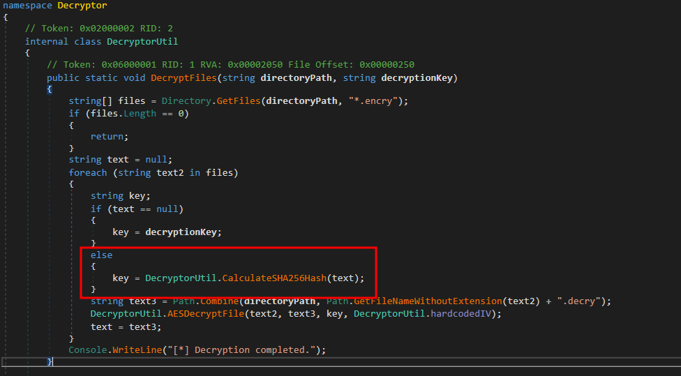

# Solution (UNSOLVED)
- Download the blackcatII.7z file on a Windows machine.
- Unzip it.
- The file "Decryptor.exe" is a .NET compiled executable. Open it the with dnSpy. Notice that the decryption key is used just the first time. Then, the decryption key is the SHA256 hash of the previous decrypted file.



- If the SHA256 hash of the first file is known, the other encrypted files can be decrypted. The first file is "A_Sunday_Afternoon_on_the_Island_of_La_Grande_Jatte_by_Georges_Seurat_5773ff06-a03e-401b-8914-6106bc277bfd_large.jpg". So, the unecrypted image must be found to decrypt the files. Google "top 100 pantings" and open the blog "https://www.atxfinearts.com/blogs/news/100-most-famous-paintings-in-the-world" to get the needed image. Notice the image link has the same GUID of the encrypted file path.
- Generate the SHA256 hash of the image.
```powershell
 Get-FileHash A_Sunday_Afternoon_on_the_Island_of_La_Grande_Jatte_by_Georges_Seurat_5773ff06-a03e-401b-8914-6106bc277bfd_large.jpg
```


- The SHA256 is the decryption key.


