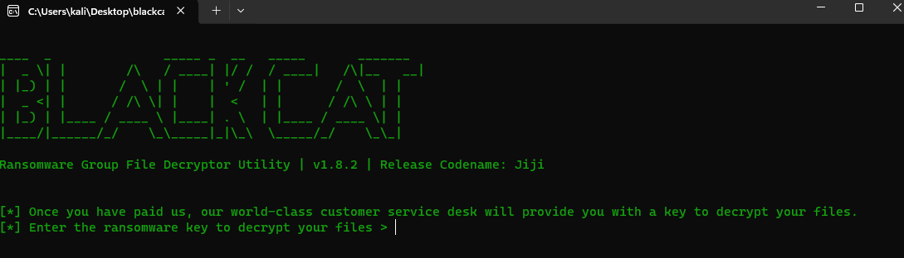
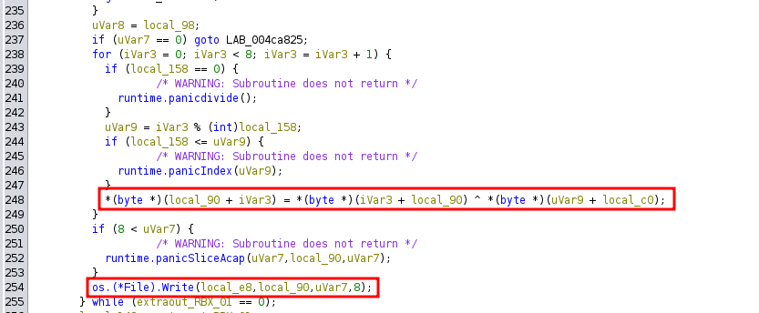
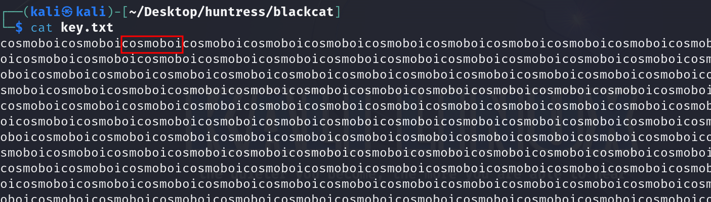
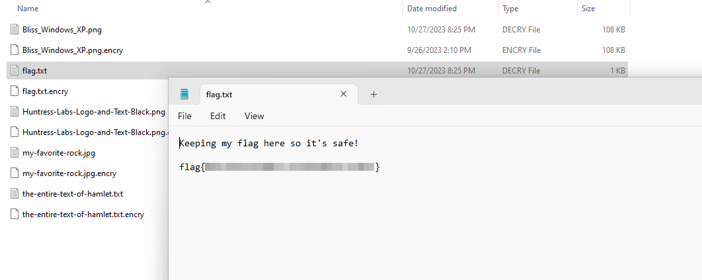

# Solution
- Download the blackcat.7z file.
- Unzip it.
```bash
7z e blackcat.7z
```
- Running "DecryptMyFiles.exe" on Windows shows a key is needed to decrypt the files.



- Open "DecryptMyFiles.exe" with Ghidra. It has been written in Go which adds a lot of junk. Search when the decrypted files are written to the disk in the "main" function. Before that operation, a XOR operation has been performed.



- One of the encrypted file is the original text of hamlet. Get the clear text file from here https://gist.github.com/provpup/2fc41686eab7400b796b and save it in "hamlet.txt"
- Need to perform a XOR between the clear text "hamlet.txt" and the encrypted version "the-entire-text-of-hamlet.txt.encry". Develop a Python script called "xor.py" for it.
```Python
#!/usr/bin/env python3

import sys


file1 = bytearray(open(sys.argv[1], 'rb').read())
file2 = bytearray(open(sys.argv[2], 'rb').read())

size = len(file1) if len(file1) < len(file2) else len(file2)
xoredRes = bytearray(size)

for i in range(size):
    xoredRes[i] = file1[i] ^ file2[i]

open(sys.argv[3], 'wb').write(xoredRes)

print("Done, check the output file")
```
- Run the Python script passing the two files as argument ans save the output in a file called "key.txt".
```bash
./xor.py hamlet.txt the-entire-text-of-hamlet.txt.encry key.txt
```
- Cat the "key.txt" output to get the decryption key.
```bash
cat key.txt
```



- Run again the "DecryptMyFiles.exe" on Windows using the retrieved key and read the flag.


