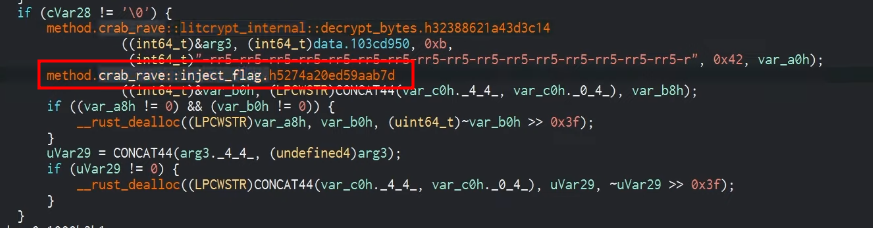

# Solution (UNSOLVED)
- Download the crab_rave_easier.7z file on a Windows machine.
- Unzip it.
- Notice the LNK file that is calling the "ntcheckos.dll".
```powershell
cat company_financial_report_SAFE_NO_VIRUSES.csv
```


- Open "ntcheckos.dll" with Cutter. A method "inject_flag" is called. So, write down the memory address.




- Patch the "NtCheckOSArchitecture" function to jump to the address saved before. Save the new file.


- Run the "ntcheckos.dll" to get the flag.
```powershell
rundll32.exe ntcheckos.dll,DLLMain
```


