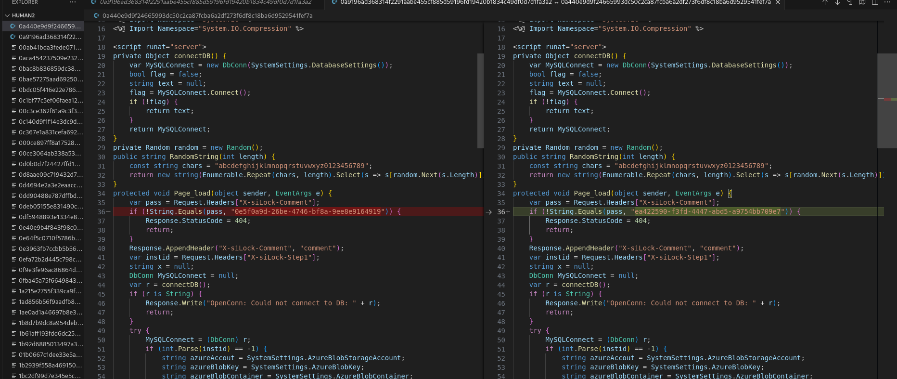
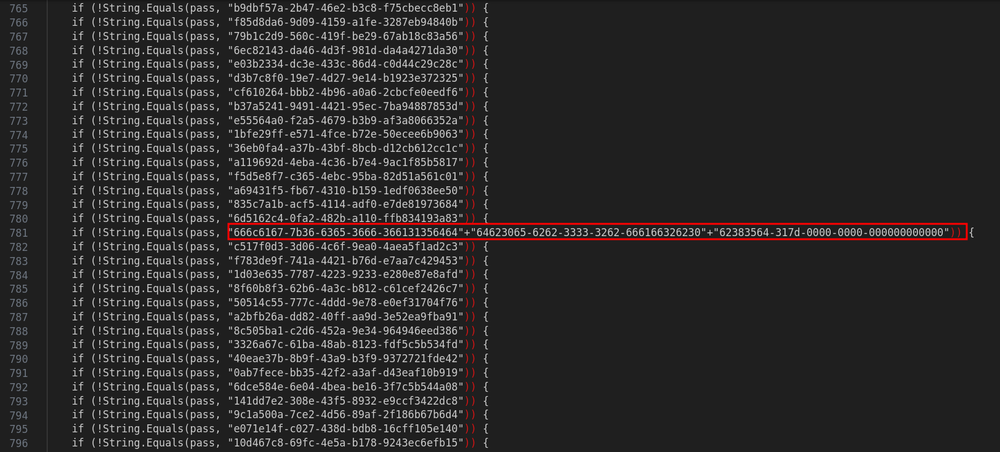
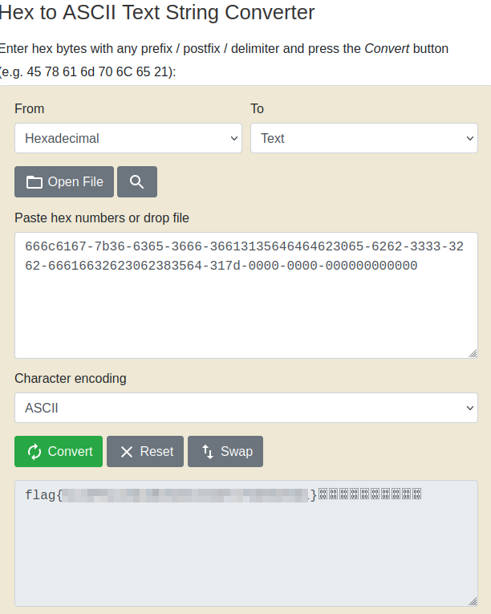

# Solution
- Download the human2.aspx_iocs.zip file.
- Unzip the file and get many other different files.
```bash
unzip human2.aspx_iocs.zip 
```
- Open the folder with Visual Studio Code and compare the first two files. Notice there is just one different.



- Extract all the differences and save it into "diff.txt" file with the following bash script:
```bash
#!/bin/bash

for file in human2/*; 
do 
        cat $file | grep 'String.Equals(pass,' >> diff.txt
done
```
- Open "diff.txt" file and find the a line that is longer than all the others.



- Some the different UUIDs to get the final string.
```bash
666c6167-7b36-6365-3666-36613135646464623065-6262-3333-3262-66616632623062383564-317d-0000-0000-000000000000
```
- Convert the long string from hexadecimal to ASCII to get the flag.


