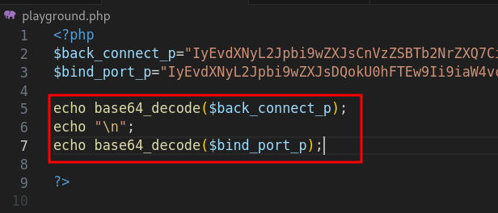

# Solution
- Download the phonetic file.
- The PHP code looks very obfuscated. However, some human readable code can be found at the beginning and at the end.


- Create a PHP file called "playground.php" where PHP code can be executed. Copy the first and last lines of code in "playground.php" stripping out the comments. Let's print out the value of the variables "$fsPwhnfn8423" and "$oZjuNUpA325".


```bash
php playground.php
```


- Those two variables are respectively "base64_decode" and "strrev". Let's make some substitutions in the last few lines of the code on variables "$k" and "$c". Then, print the value of the variable "$k".


```bash
php playground.php
```


- "$k" is "create_function". At this point, the payload is stored in the variable "$gbaylYLd6204" and it is likely deobfuscated by the operation "base64_decode( deGRi(base64_decode($gbaylYLd6204), "tVEwfwrN302"))". Let's run it and save the output into a file called "stage2.php".


```bash
php playground.php > stage2.php
```

- Opening stage2.php almost everything looks deobfuscated excpet for two variables at line 1459 and 1460.


- Clear "playground.php" and copy those two variables in it. Print the base64 decode value of them and save the output into "stage3" file.



```bash
php playground.php > stage3
```

- The new script is written in Perl and there is a value which is uuencode.


- The flag is obtained uudecoding the data. It can be done at this website https://decode.urih.com/.


