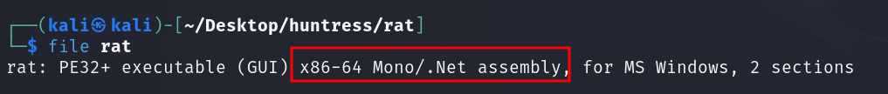
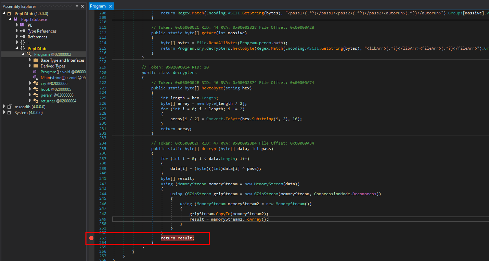
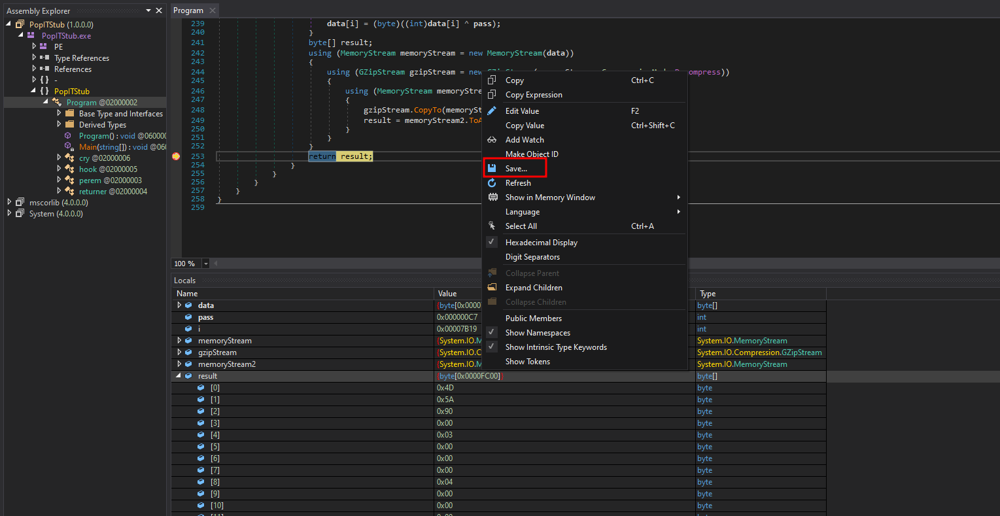
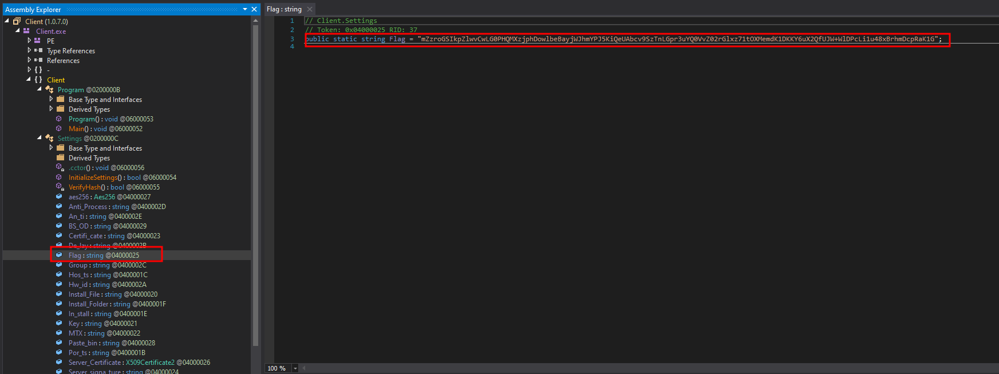
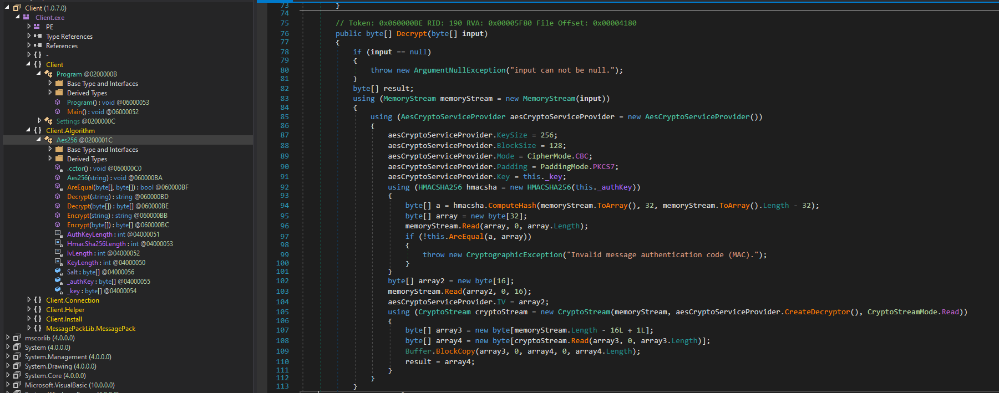
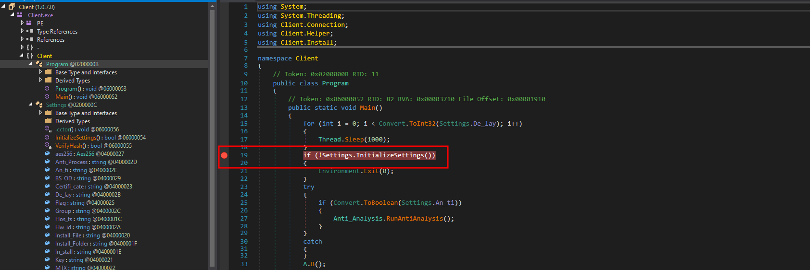
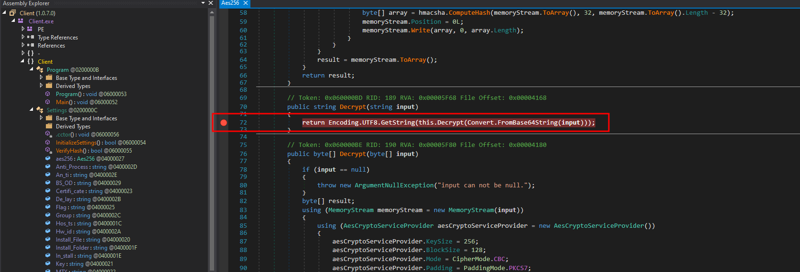
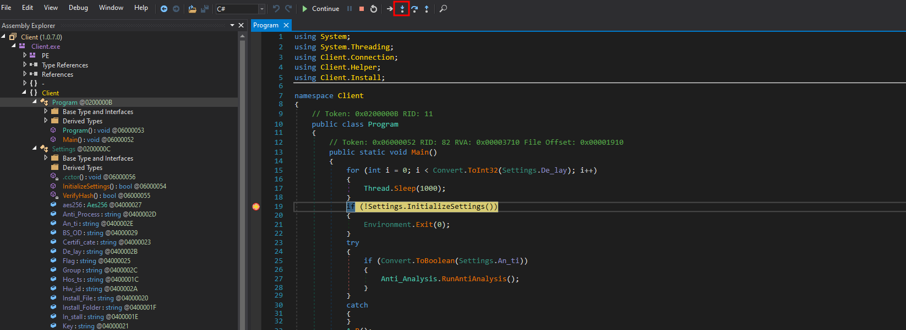
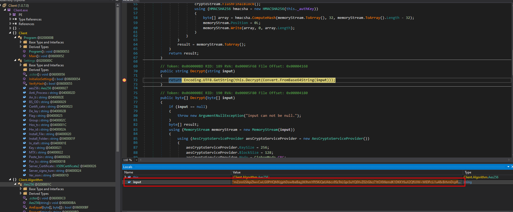
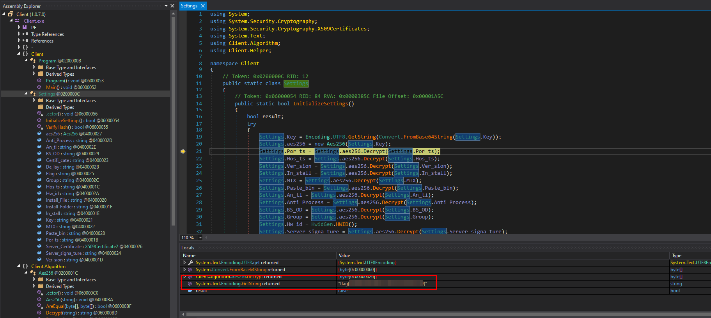

# Solution
- Download the rat.7z file.
- Unzip the file.
```bash
7z e rat7z
```
- Run the command file.
```bash
file rat
```



- Move the "rat" executable on a Windows machine and open it with dnSpy (https://github.com/dnSpy/dnSpy). Looking at PopIT Stub, there is a "decrypt" method. Add a breakpoint and let the program run.



- When the breakpoint is hit, expand the "result" variable and save the value in another file called "stage2".



- Open "stage2" with dnSpy and notice the flag variable encrypted. The encryption/decryption method is in the Client.Algorithm namespace.





- Copy the encrypted flag value. Set a breakpoint at line 19 in Program under Client namespace.



Set another breakpoint at the Decrypt function in AES256 under the Client.Algorithm namespace.



- Let the program run. "Step into" when the first breakpoint is hit.



Change the "input" variable to the encrypted flag when the second breakpoint is hit.



- Let the program run and get the flag from the returned value.



- Uploading "rat" executable in Virus Total or Hybrid Analysis can lead to the flag disclosure as well.

