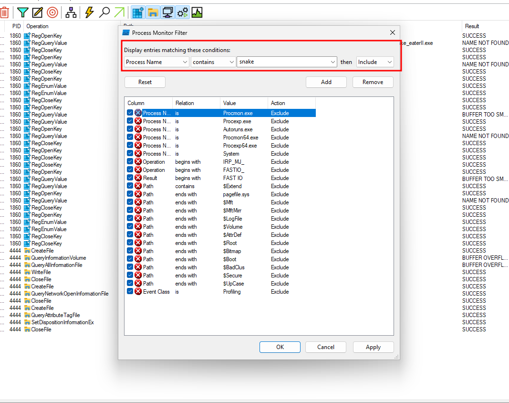
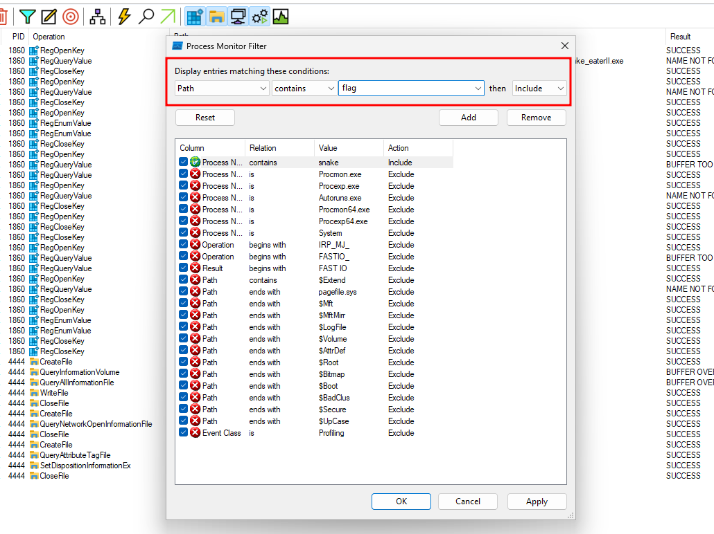
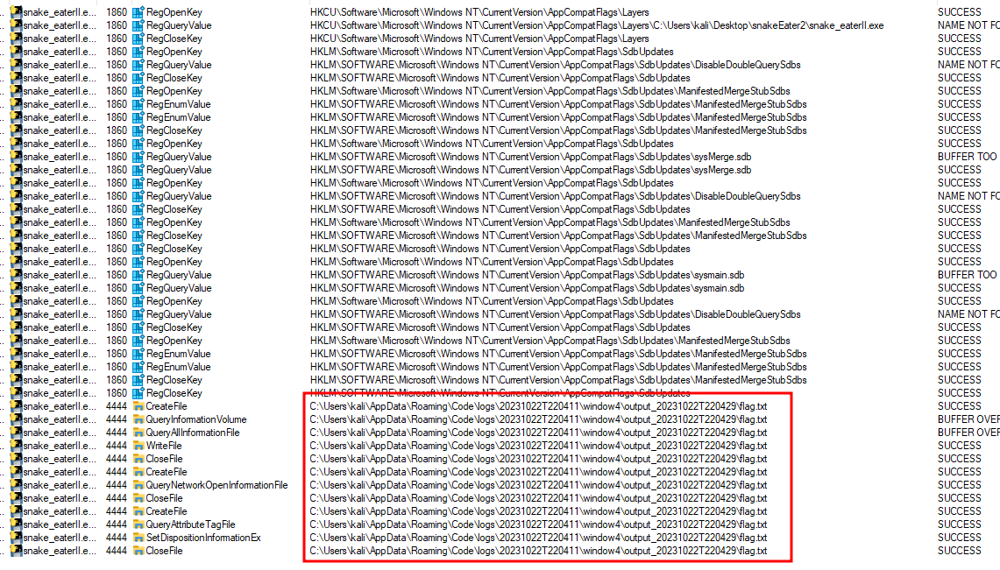
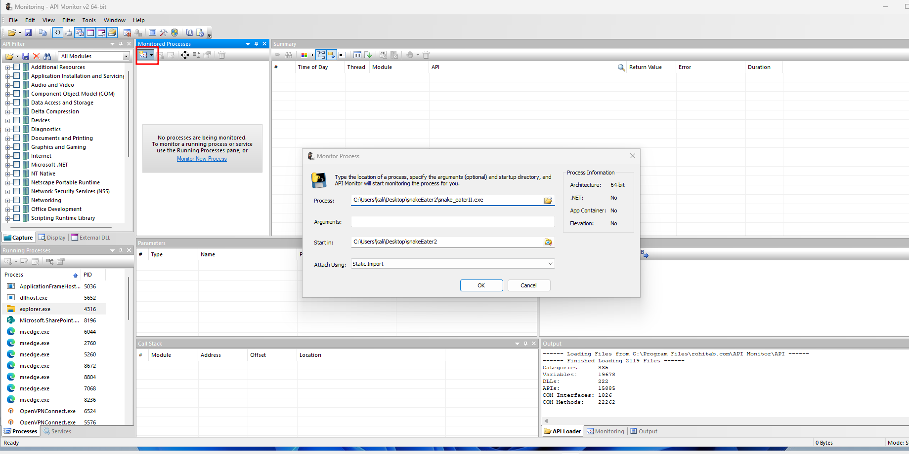
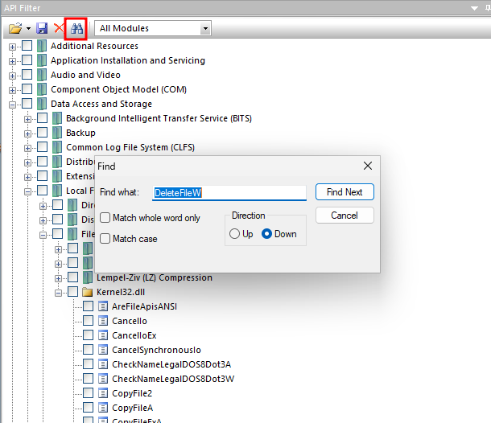
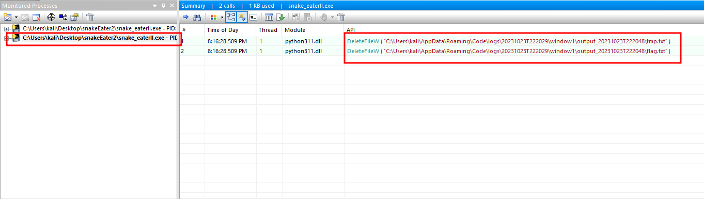
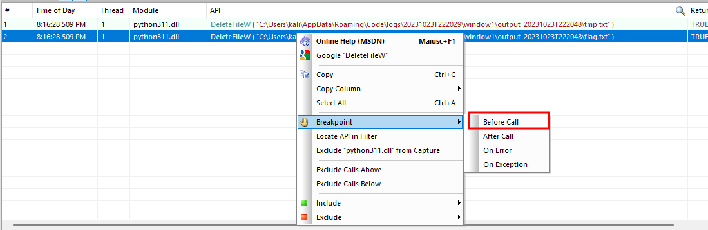
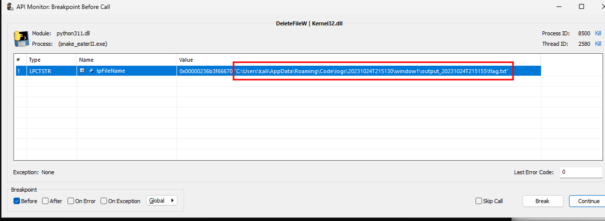
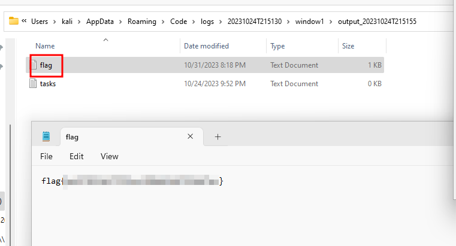

# Solution
- Download the snake_eaterII.7z file on a Windows machine.
- Unzip the file.
- Run Procmon and snake_eaterII. Apply a filter in Procmon to monitor for a process that contains "snake" in the name.

- Apply a new filter to monitor for files with "flag" in the name. A file called "flag.txt" is created and deleted.

- Need a breakpoint to read the "flag.txt" file before it gets deleted. Download and install API Monitor http://www.rohitab.com/apimonitor. Run API Monitor V2 64-bit and import the snake_eaterII executable.

- Set the filter for the Windows function "DeleteFileW".

- Running again, notice the two files deleted reported by the filter.

- Set up a break point before the operation right clicking on the "DeleteFileW" operation for the file "flag.txt".

- Run again the snake_eaterII executable and reach the breakpoint.

- Follow the path to read the file "flag.txt" and get the flag.

