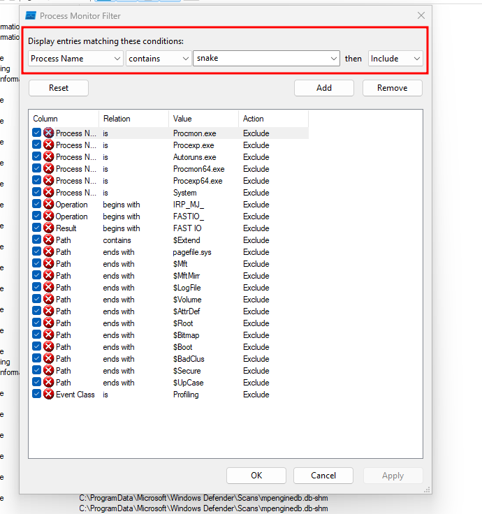
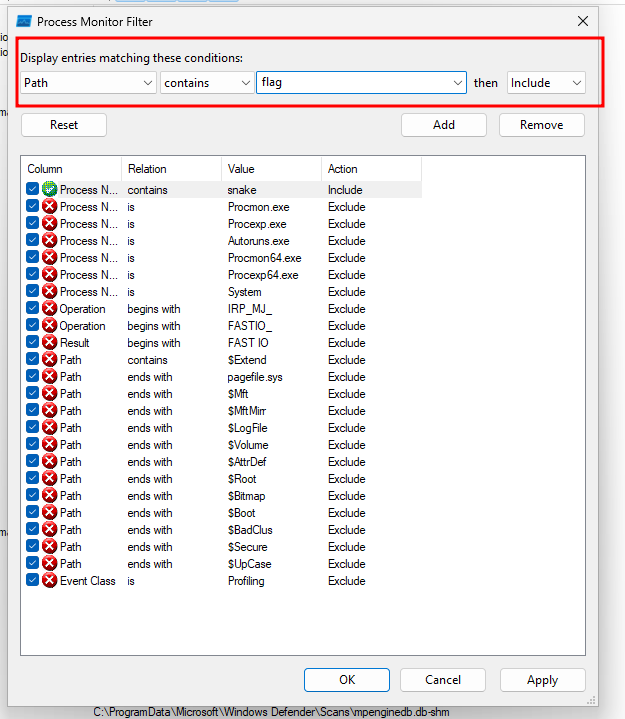
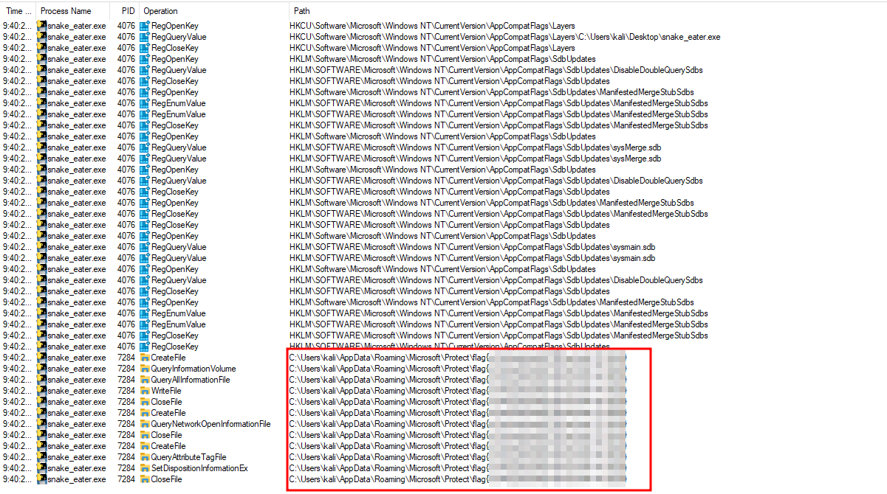

# Solution
- Download the snake_eater.7z file on a Windows machine.
- Unzip the file.
- Run Procmon and snake_eater. Apply a filter in Procmon to monitor for a process that contains "snake" in the name.

- Apply a new filter to monitor for files with "flag" in the name. The flag shows up.

