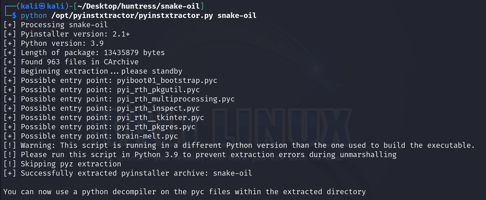
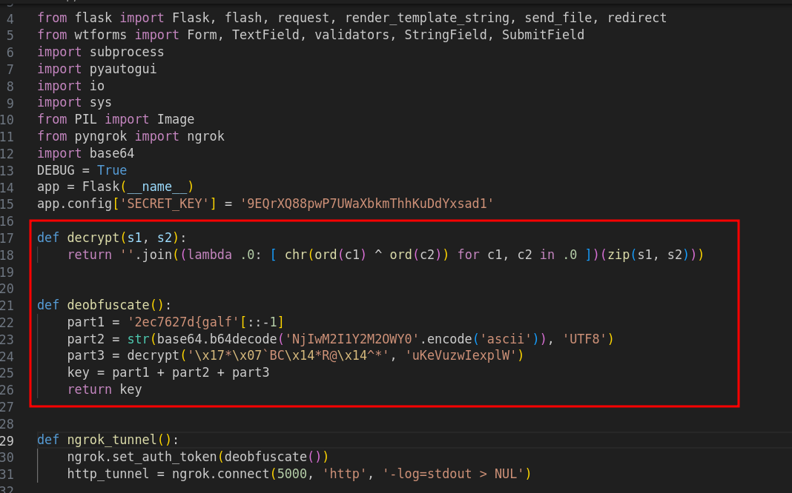
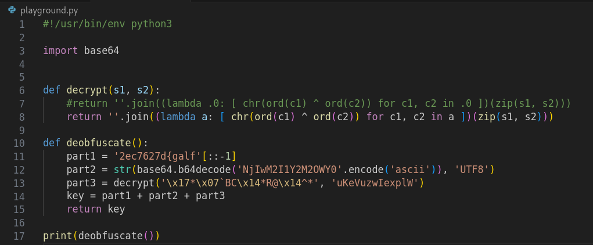
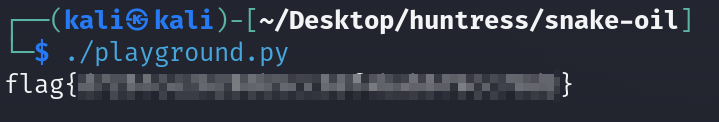

# Solution
- Download the snake_oil file.
- Use pyinstxtractor (https://github.com/extremecoders-re/pyinstxtractor) to extract the compiled files from a PyInstaller generated executable.
```bash
python /opt/pyinstxtractor/pyinstxtractor.py snake-oil
```



- Use pycdc (https://github.com/zrax/pycdc) to decompile the brain-melt.pyc file and ave the output into brain-melt.py
```bash
/opt/pycdc/pycdc brain-melt.pyc > brain-melt.py
```
- Notice two interesting Python functions called "decrypt" and "deobfuscate".



- Open a new Python script called "playground.py" and copy those two functions. Perform a small fix on the decrypt function.Print the key variable of the decrypt function to get the flag.



```bash
./playground.py
```



- Uploading snake_eater executable in Virus Total or Hybrid Analysis can lead to the flag disclosure as well.
