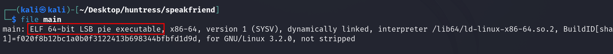
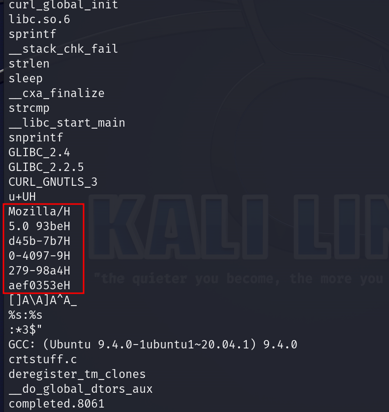
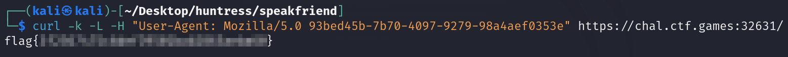

# Solution
- Hit the start button and download the main.7z file.
- Extract the file.
```bash
7z e main.7z
```
- The web page does not look suspicious browsing the link with https.


- The extracted file is an ELF file. It can be verified with the following command:
```bash
file main
```



- Let's run the command strings on the extracted "main" file. Notice an interesting "User-Agent".
```bash
strings main
```



- The flag can be obtained performing a GET request with the discovered "User-Agent" and following the redirect:
```bash
curl -k -L -H "User-Agent: Mozilla/5.0 93bed45b-7b70-4097-9279-98a4aef0353e" https://chal.ctf.games:32631/
```


