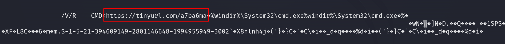
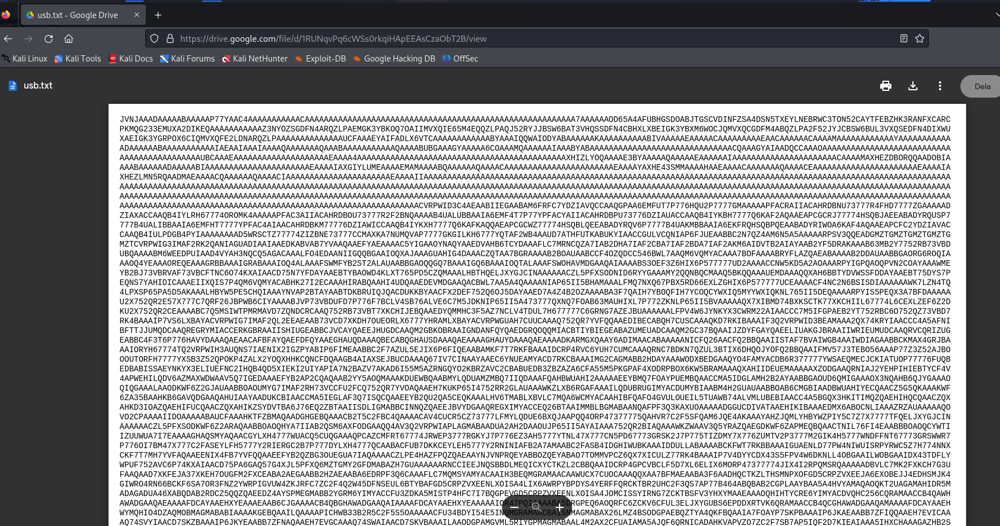
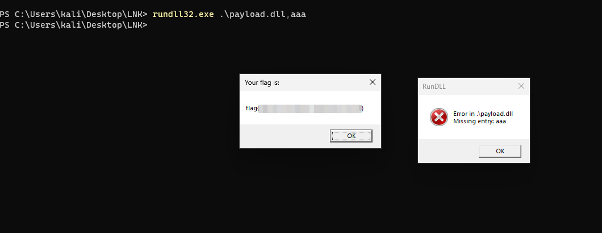

# Solution
- Download the ADATA_128GB.lnk.download file.
- Cat the file content and get the tiny url at the end.
```bash
cat ADATA_128GB.lnk.download
```



- Browse the link and save the obfuscated content file into "usb.txt".



- Base32 decode the file and save into "payload".
```bash
cat usb.txt | base32 -d > payload 
```
- "payload" is a DLL checking the file type.
```bash
file payload
```


- Rename "payload" into "payload.dll" and move in a Windows machine.
```bash
mv payload payload.dll
```
- Run the dll calling a random function to get the flag.
```PowerShell
rundll32.exe .\payload.dll,aaa
```


