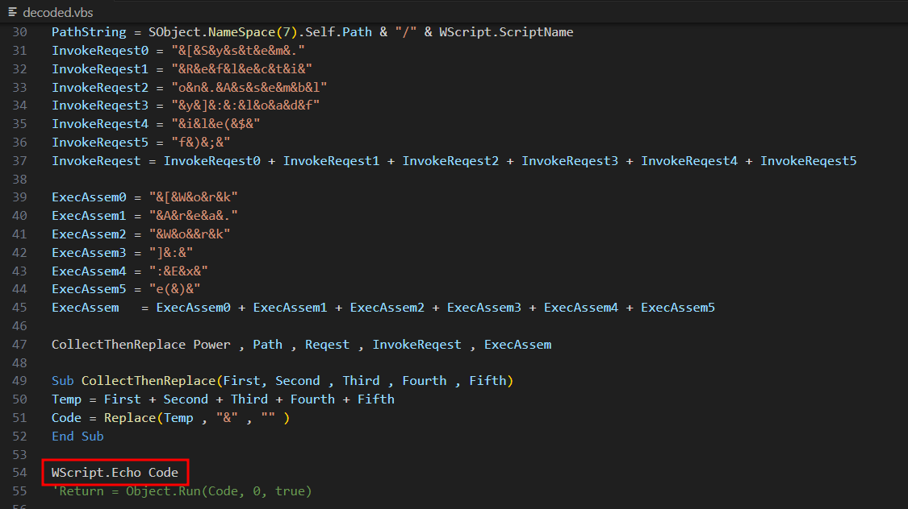
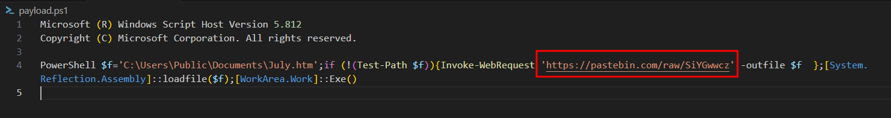
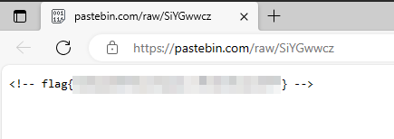

# Solution
- Download the veebeeeee file.
- The characters "#@" are at the beginning and at the end of the file which might mean the file is a Visual Basic Script encoded. The GitHub repository https://github.com/JohnHammond/vbe-decoder provides a Visual Basic Script decoder. Run the decoder and save the output into the file "decoded.vbs"
```bash
python /opt/vbe-decoder/vbe-decoder.py veebeeee -o decoded.vbs
```

- Now the file is more readable, but it is still obfuscated. Copy the file in to a Windows machine. Let the code run and print the variable "Code". Save the output in the file "payload.ps1".



```PowerShell
cscript.exe .\decoded.vbs > payload.ps1
```

- The PowerShell script is reaching out a pastebin link. The flag can be found at that link.




