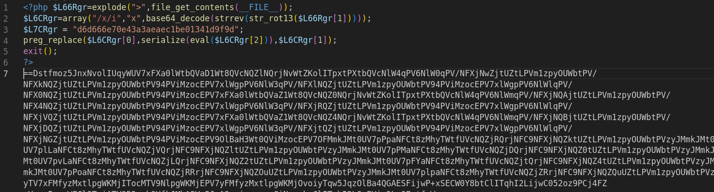
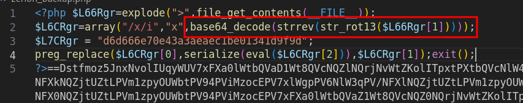
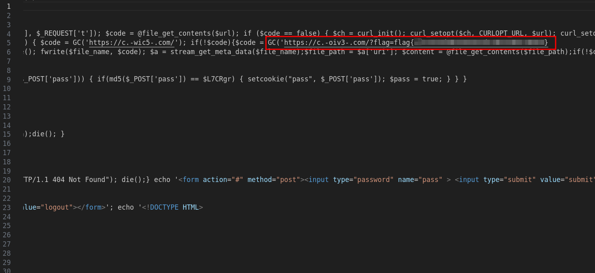

# Solution
- Download the zerion file.
- Notice PHP obfuscated code and try to format it. The first lines are used to manipulate and run the payload which is big chunk of data starting at line 7.



- Let's base64 decode wherever is possible in the first five line. Following the code, the payload is deobfuscated at line 2.



- Code a PHP script called "clear.php" to print the deobfuscated payload.
```php
<?php
$payload=base64_decode(strrev(str_rot13("OBFUSCATED PAYLOAD")));
echo $payload;
>
```
- Run the code and save the output into "deobfuscated.php":
```bash
php clear.php > deobfuscated.php
```

- The flag is at line 5 of the "deobfuscated.php" file.


