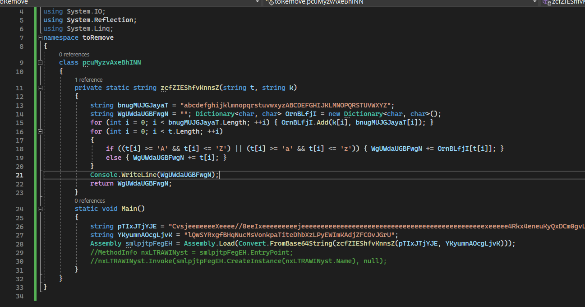

# Solution
- Download the babel.7z file on a Windows machine.
- It looks C# code. Create a C# Console App in Visual Studio and copy the babel content.
- Format the code and print out the variable content "WgUWdaUGBFwgN" before the end of the function. Copy the output into a file called "stage2".



- Base64 decode the "stage2" content and save the output in a file called "stage2Dec".
```bash
cat stage2 | base64 -d > stage2Dec
```
- Run the command "strings" on the output file "stage2Dec" to get the flag.
```bash
strings stage2Dec | grep flag
```


