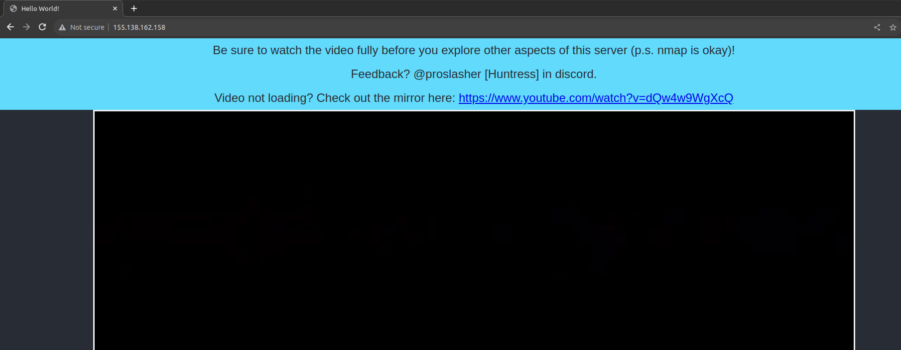
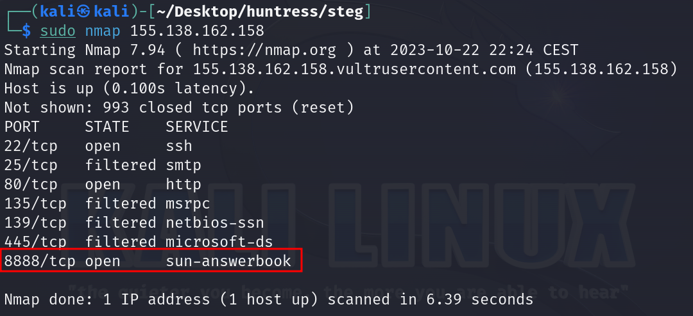
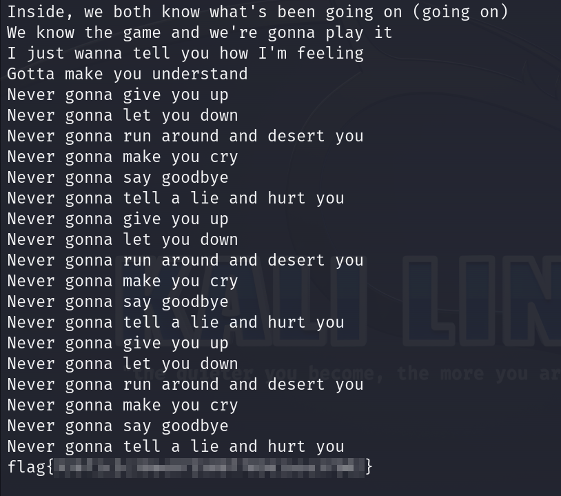

# Solution
- Browse the link from the challenge http://155.138.162.158/.



- Run plain nmap on the IP:
```bash
nmap 155.138.162.158
```



- Connect to port 8888 with netcat and get the flag (after getting rick rolled).
```bash
nc 155.138.162.158 8888
```


