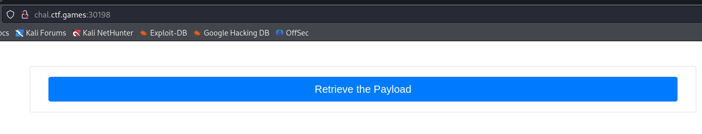
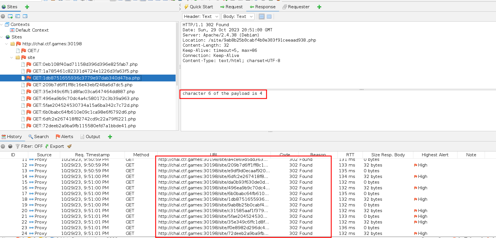
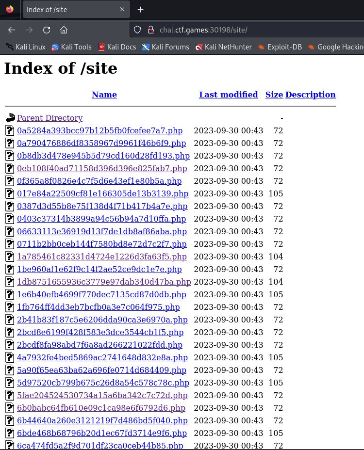

# Solution
- Hit the start button.
- Open Owasp ZAP and run the layer 7 proxy to inspect the traffic while browsing the challenge link. Click the button and look at the traffic.





- There are many HTTP redirects and there is data in the response in some of them. All the PHP files are visible at the path "/site".



- Run the Owasp ZAP crawler at the path "/site" to get all the links. Save all the redirects link in a fille called "redirects.txt".


- Build a Python script to get all the redirect response data, filter and order it to get the flag. The script is not perfect, but it works.
```python
#!/usr/bin/env python

import requests

def main():
    flags = []
    with open('redirects.txt', 'r') as f:
        for line in f:
            res = requests.get(url=str(line.strip()), allow_redirects=False)
            if res.text != "":
                flags.append(res.text.strip())
    dictFlag = {}
    for flag in flags:
        tmp = flag.split(" ")
        if tmp[-1] != "":
            dictFlag.update({int(tmp[1]):tmp[-1]})
    sortedFlag = dict(sorted(dictFlag.items()))
    finalFlag = ""
    for c in sortedFlag.values():
        finalFlag = finalFlag + c
        print(finalFlag)

if __name__ == '__main__':
    main()
```


