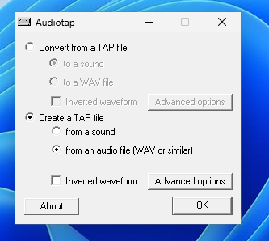
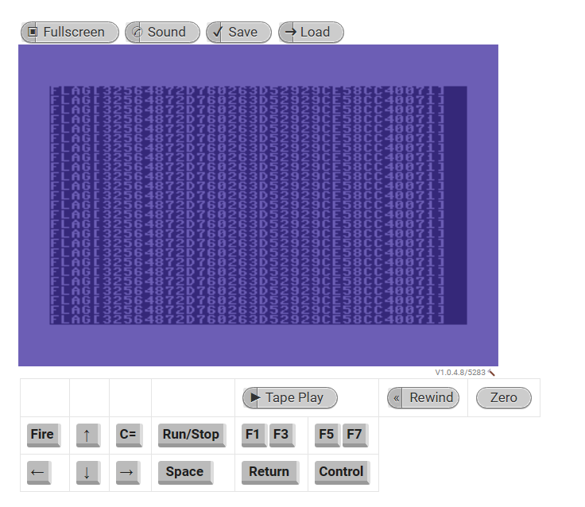

# Solution
- Download the pressplayontape.wav file on a Windows machine.
- Convert the wav file into a tap file with AudioTap https://wav-prg.sourceforge.io/audiotap.html.

- Upload the tap file in a commodore 64 emulator (https://c64online.com/c64-online-emulator/) and wait for the flag to be displayed.

