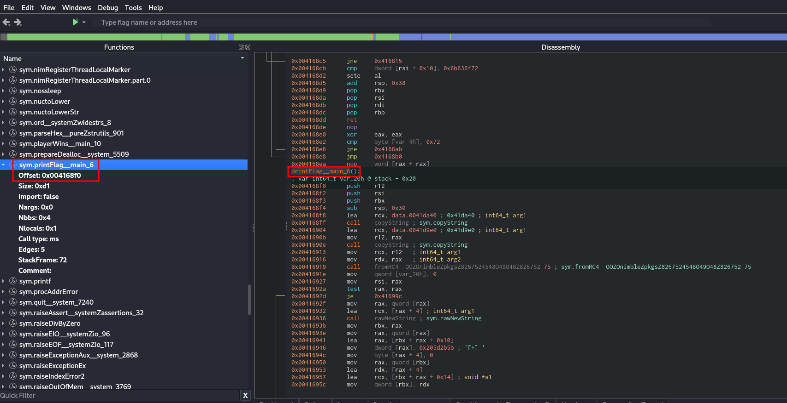
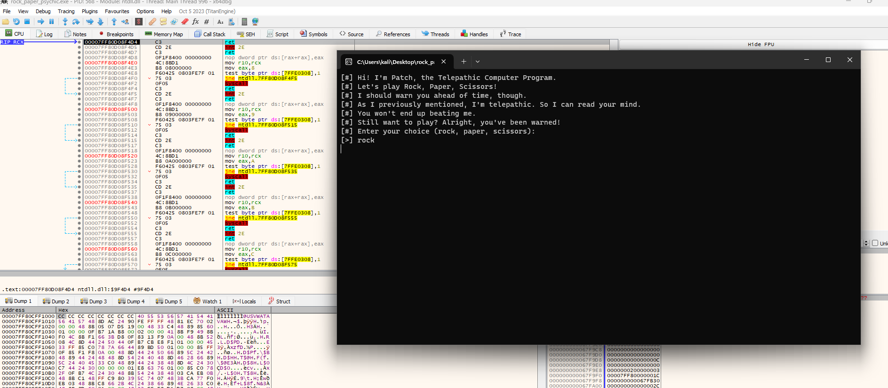
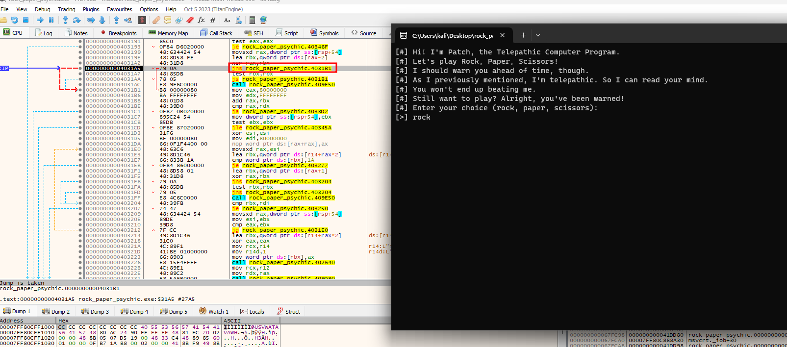
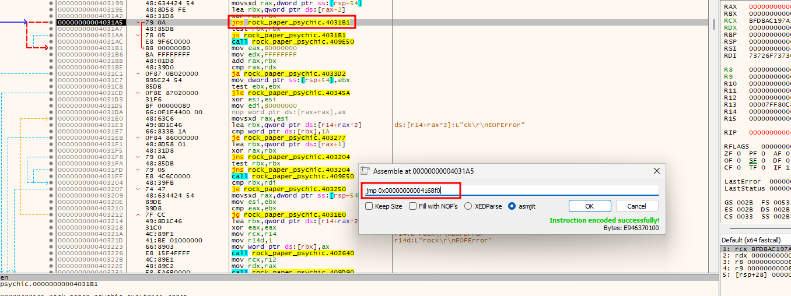
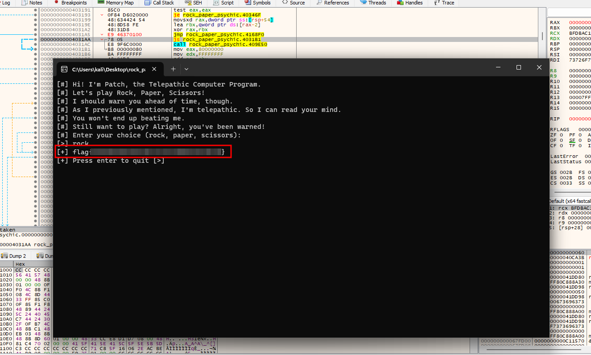

# Solution
- Download the rock_paper_psychic.7z file.
- Unzip the file.
```bash
7z e rock_paper_psychic.7z
```
- Open the "rock_paper_psychic" executable with Cutter. Notice the funtion "printFlag__main_6" and save the offset which is "0x004168f0".



- Move the "rock_paper_psychic" executable on a Windows machine with x64dbg installed. Run "rock_paper_psychic" withing x64dbg. Let the program run until the user has to pick. 


- Perform the choice and go ahead with the debugger until a jump function in the rock_paper_psychic context is met.



- Edit the jmp function available changing the operation to "jmp" and the address to the "printFlag__main_6" function. It can be done righ clicking on the assembly line and selecting "Assemble".



- Let the debugger run and the flag shows up.


