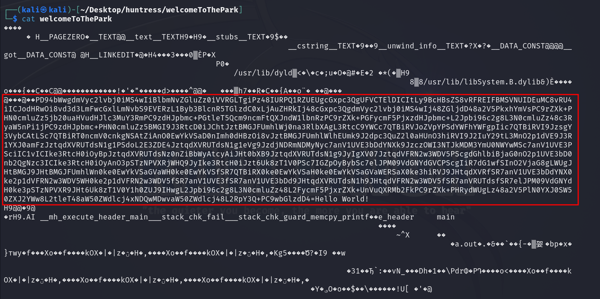

# Solution
- Download the welcomeToThePark.zip file.
- Unzip the file.
```bash
unzip welcomeToThePark.zip
```
- Cat the conent of "welcomeToThePark" file and notice an obfuscated chunk of data.
```bash
cat welcomeToThePark
```



- Base64 Decode the data chunk and save the output in a file called "decoded".
```bash
echo -n <DATA> | base64 -d > decoded
```

- There is a zsh script embedded in the XML file.


- Copy the script and output the command.


```bash
./zshScript
```


- There is a link in the output: https://gist.github.com/stuartjash/a7d187c44f4327739b752d037be45f01. Download the image found at the link.


- Cat the image content to get the flag.
```bash
cat JohnHammond.jpg
```


