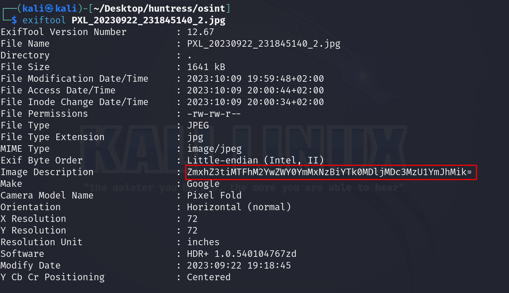

# Solution
- Download the "PXL_20230922_231845140_2.jpg".
- Run exiftool on the image.
```bash
exiftool PXL_20230922_231845140_2.jpg
```



- The description field contains base64 encoded data. Perform a base64 decoding to get the flag.
```bash
echo -n ZmxhZ3tiMTFhM2YwZWY0YmMxNzBiYTk0MDljMDc3MzU1YmJhMik= | base64 -d
```


