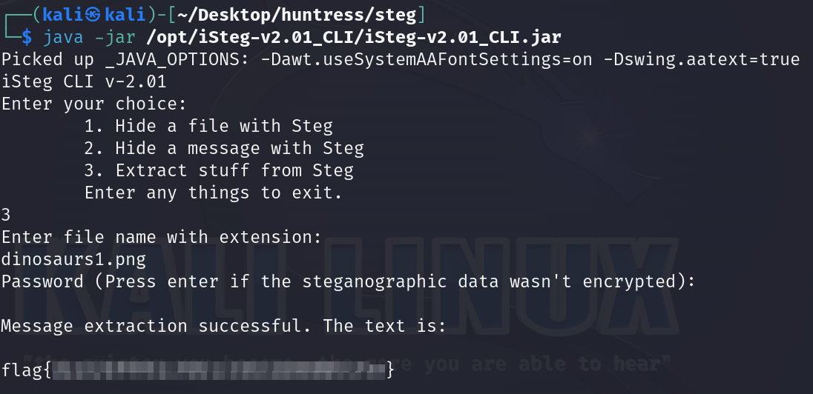

# Solution
- Download the dinosaurs1.png file.
- Download the tool iSteg https://github.com/rafiibrahim8/iSteg.
- Run iSteg to extract the flag hidden in the image file.
```bash
java -jar /opt/iSteg-v2.01_CLI/iSteg-v2.01_CLI.jar
```


