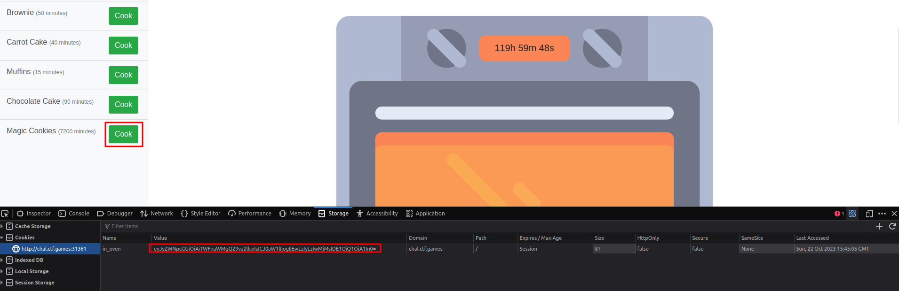
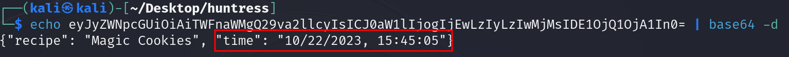
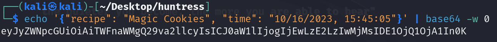
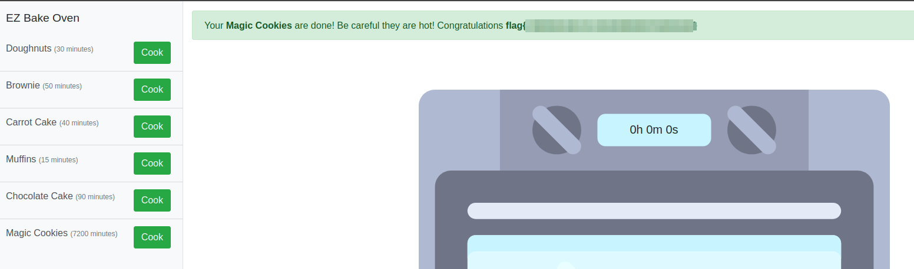

# Solution
Steps:
- Start the challenge.
- Clikc the button "Cook" for the Magic Cookies and check out the cookie.



- Base64 decode the cookie and notice there is a "time" which can be manipulated.
```bash
echo <COOKIE> | base64 -d
```



- Let's set the "time" value 6 days before.
```bash
{"recipe": "Magic Cookies", "time": "10/16/2023, 15:45:05"}
```
Then, base64 encode the new cookie.
```bash
echo '{"recipe": "Magic Cookies", "time": "10/16/2023, 15:45:05"}' | base64 -w 0
```


- Update the session cookie in the browser with the new one and refresh the page to get the flag.


