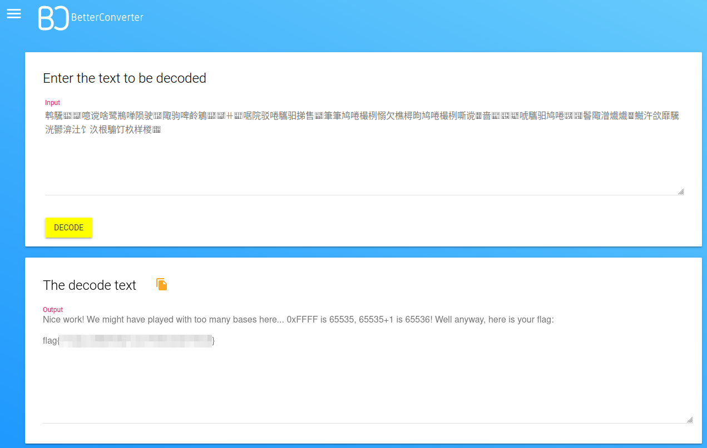

# Solution
Steps:
- Download the baseffff1 file from the challenge.
- The hexadecimal sum ffff+1 is 65536.
- Google base65536 converter and land at this link https://www.better-converter.com/Encoders-Decoders/Base65536-Decode.
- Decode the file content and get the flag.

