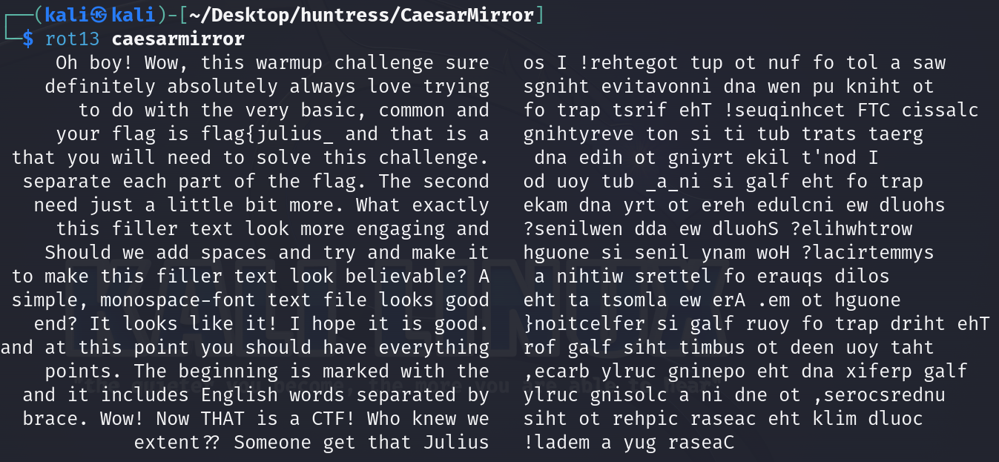
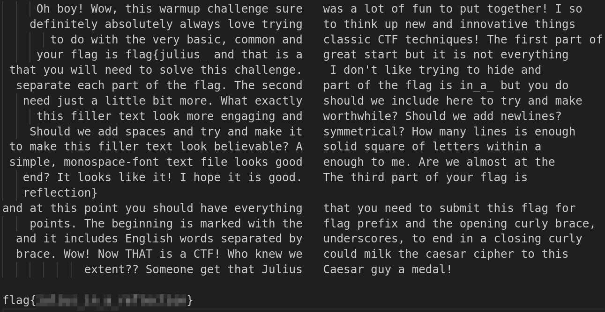

# Solution
Steps:
- Download the caesarmirror file from the challenge. Remember the flag is not in the standard format for this challenge.
- Run the rot13 (Caesar Cipher) to the file:
```bash
rot13 caesarmirror
```



- The right side is mirrored. Extract the right side, mirror it (https://rotate-text.com/) and replace it where it was. It can be done with some VS Code-fu.
- Read the text to get the flag.


