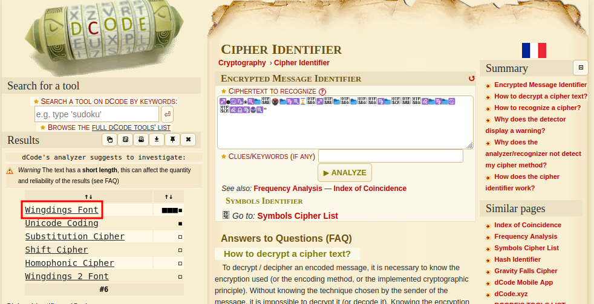
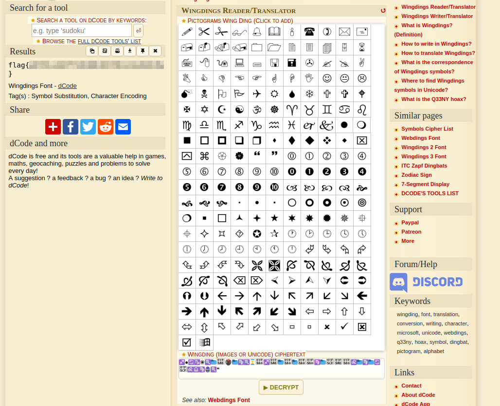

# Solution
Steps:
- Download the chicken_wings file from the challenge.
- Copy the file content in the Cipher Identifier tool of dcode.fr (https://www.dcode.fr/cipher-identifier).

- Notice there is a match with the Windging Font. Follow the link (https://www.dcode.fr/wingdings-font) and decode it.

# Resources
- https://www.dcode.fr/
