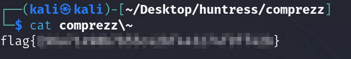

# Solution
Steps:
- Download the comprezz file from the challenge.
- Extract the the content with 7z:
```bash
7z e comprezz
```
- Run the following command and notice the file that ends with ~:
```bash
ls
```
- Cat the content file and get the flag:
```bash
cat comprezz\~
```


