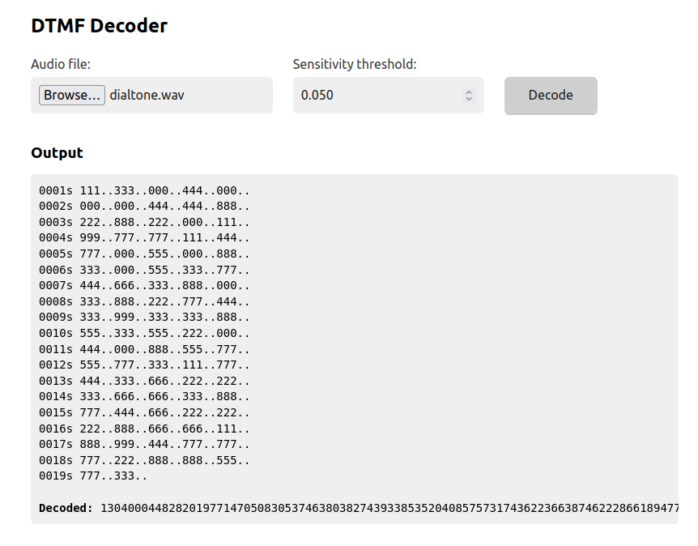
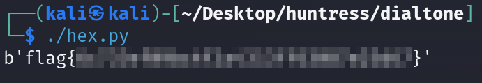

Steps:
- Download the dialtone.wav file from the challenge.
- The audio file is playing tones related to phone numbers.
- The decoder https://dtmf.netlify.app/ shows up googling for DTMF decoder.



- It decoded a long int. The link https://captainmich.github.io/programming_language/CTF/Challenge/CryptoHack/general.html has been found googling for "from long to bytes ctf".
- According to the previous resource, a small Python script is needed to get flag:
```python
#!/usr/bin/env python3

from Crypto.Util.number import bytes_to_long
from Crypto.Util.number import long_to_bytes

data = 13040004482820197714705083053746380382743933853520408575731743622366387462228661894777288573
bytes = long_to_bytes(data)
print(bytes)
```
- Running the script we have the flag.


