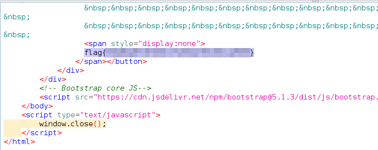

# Solution
Steps:
- Start the challenge.
- Open the challenge link and click the "Capture the Flag" button. Notice a new window is opened and closed immediately.
- Run OWASP ZAP to block and inspect HTTP traffic.
- Click again the "Capture the Flag" button and inspect the traffic with OWASP-ZAP.
- A request to /capture_the_flag.html is performed and the flag is in the response.

