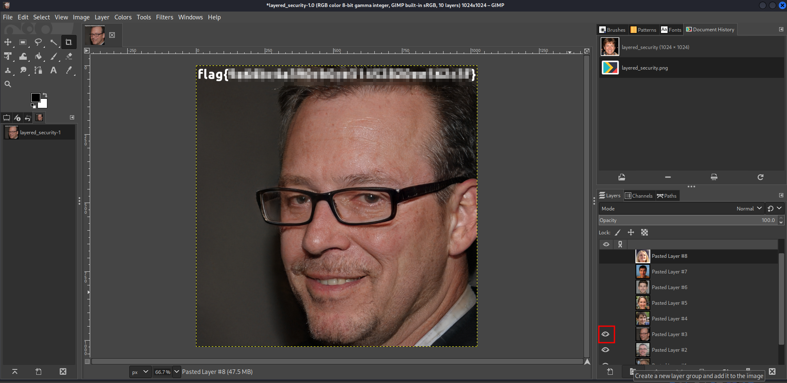

# Solution
Steps:
- Download the layered_security file from the challenge.
- It is a GIMP file. It can be confirmed running the command:
```bash
file layered_security
```
- There are many images opening the file with GIMP. Each image is a layer that can be hidden with GIMP.
- Let's hide the image one by one until the flag shows up in an image.


